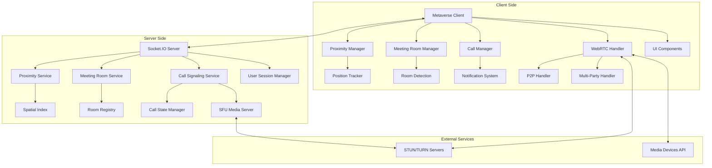

# Video Call Feature Design Document

## Overview

The video call feature implements a dual-mode video calling system: meeting room mode for multi-party conferences when users are in designated coordinates, and peer-to-peer mode for one-on-one calls in regular proximity. The system uses WebRTC with different topologies (mesh/SFU for meeting rooms, direct P2P for individual calls), Socket.IO for signaling, and spatial algorithms for both proximity and meeting room detection.

## Architecture

### High-Level Architecture



### System Flow

#### Meeting Room Mode
1. **Room Detection**: Client sends position updates → Server detects meeting room entry → Server notifies client of room availability
2. **Auto-Join**: Client displays room participants → User confirms join → Server adds user to room session
3. **Multi-Party WebRTC**: Server coordinates SDP exchange between all participants → SFU/Mesh topology established
4. **Room Management**: Server manages participant list and handles join/leave events

#### Peer-to-Peer Mode  
1. **Proximity Detection**: Client sends position updates → Server calculates nearby users (excluding those in rooms) → Server broadcasts proximity updates
2. **Call Initiation**: User selects target → Client sends call request → Server validates and forwards → Target receives notification
3. **Direct WebRTC**: Both clients exchange SDP offers/answers through server signaling → Direct P2P connection established
4. **Call Management**: Clients handle media streams directly while server tracks call state

## Components and Interfaces

### Client-Side Components

#### ProximityManager
```typescript
interface ProximityManager {
  updatePosition(x: number, y: number, z: number): void;
  getNearbyUsers(): User[];
  onNearbyUsersChanged(callback: (users: User[]) => void): void;
  // Note: Range is fixed at 10 units for MVP
}
```

#### MeetingRoomManager
```typescript
interface MeetingRoomManager {
  detectMeetingRoom(position: Position3D): MeetingRoom | null;
  joinMeetingRoom(roomId: string): Promise<MeetingRoomSession>;
  leaveMeetingRoom(roomId: string): void;
  getMeetingRoomParticipants(roomId: string): User[];
  onMeetingRoomAvailable(callback: (room: MeetingRoom) => void): void;
  onParticipantJoined(callback: (participant: User) => void): void;
  onParticipantLeft(callback: (participant: User) => void): void;
}
```

#### CallManager
```typescript
interface CallManager {
  initiatePeerToPeerCall(targetUserId: string): Promise<CallSession>;
  acceptCall(callId: string): Promise<CallSession>;
  rejectCall(callId: string): void;
  endCall(callId: string): void;
  onIncomingCall(callback: (call: IncomingCall) => void): void;
  getCurrentCallMode(): 'peer-to-peer' | 'meeting-room' | null;
}
```

#### WebRTCHandler
```typescript
interface WebRTCHandler {
  createPeerToPeerConnection(config: RTCConfiguration): RTCPeerConnection;
  createMeetingRoomConnection(config: RTCConfiguration, sfuEndpoint: string): RTCPeerConnection;
  handleOffer(offer: RTCSessionDescriptionInit): Promise<RTCSessionDescriptionInit>;
  handleAnswer(answer: RTCSessionDescriptionInit): void;
  addLocalStream(stream: MediaStream): void;
  onRemoteStream(callback: (stream: MediaStream, participantId: string) => void): void;
  switchToMeetingRoomMode(participants: string[]): void;
  switchToPeerToPeerMode(): void;
}
```

### Server-Side Components

#### ProximityService
```typescript
interface ProximityService {
  updateUserPosition(userId: string, position: Position3D): void;
  findNearbyUsers(userId: string, range: number): User[];
  subscribeToProximityUpdates(userId: string, callback: (users: User[]) => void): void;
}
```

#### MeetingRoomService
```typescript
interface MeetingRoomService {
  createMeetingRoom(coordinates: Position3D, capacity: number): MeetingRoom;
  getMeetingRoomByPosition(position: Position3D): MeetingRoom | null;
  addParticipantToRoom(roomId: string, userId: string): void;
  removeParticipantFromRoom(roomId: string, userId: string): void;
  getMeetingRoomParticipants(roomId: string): User[];
  broadcastToRoom(roomId: string, message: any): void;
}
```

#### CallSignalingService
```typescript
interface CallSignalingService {
  handlePeerToPeerCallRequest(fromUserId: string, toUserId: string): void;
  handleMeetingRoomJoinRequest(userId: string, roomId: string): void;
  handleCallResponse(callId: string, accepted: boolean): void;
  relaySignalingMessage(callId: string, message: SignalingMessage): void;
  relayMeetingRoomMessage(roomId: string, message: SignalingMessage): void;
  cleanupCall(callId: string): void;
  cleanupMeetingRoomSession(roomId: string, userId: string): void;
}
```

## Data Models

### User Position
```typescript
interface Position3D {
  x: number;
  y: number;
  z: number;
  timestamp: number;
}

interface UserPosition {
  userId: string;
  position: Position3D;
  isAvailable: boolean;
  proximityRange: 10; // Fixed for MVP
}
```

### Meeting Room Models
```typescript
interface MeetingRoom {
  roomId: string;
  coordinates: Position3D;
  radius: number;
  capacity: number;
  participants: string[];
  createdAt: Date;
  isActive: boolean;
}

interface MeetingRoomSession {
  sessionId: string;
  roomId: string;
  userId: string;
  joinedAt: Date;
  status: 'joining' | 'connected' | 'disconnected';
}
```

### Call Session
```typescript
interface CallSession {
  callId: string;
  type: 'peer-to-peer' | 'meeting-room';
  participants: string[];
  roomId?: string; // Only for meeting room calls
  status: 'pending' | 'connecting' | 'active' | 'ended';
  createdAt: Date;
  connectedAt?: Date;
  endedAt?: Date;
}

interface IncomingCall {
  callId: string;
  type: 'peer-to-peer' | 'meeting-room-invitation';
  fromUser?: User; // Only for peer-to-peer
  meetingRoom?: MeetingRoom; // Only for meeting room
  expiresAt: Date;
}
```

### Signaling Messages
```typescript
interface SignalingMessage {
  type: 'offer' | 'answer' | 'ice-candidate' | 'call-end';
  callId: string;
  payload: any;
  timestamp: Date;
}
```

## Proximity Detection Algorithm

### Spatial Indexing
- Use a 3D spatial hash grid for efficient proximity queries
- Grid cell size based on fixed proximity range (10 units for MVP)
- Update frequency: 100ms for smooth real-time experience

### Distance Calculation
```typescript
function calculateDistance(pos1: Position3D, pos2: Position3D): number {
  const dx = pos1.x - pos2.x;
  const dy = pos1.y - pos2.y;
  const dz = pos1.z - pos2.z;
  return Math.sqrt(dx * dx + dy * dy + dz * dz);
}
```

### Optimization Strategies
- Implement spatial partitioning to reduce calculation overhead
- Use dirty flagging to avoid unnecessary proximity recalculations
- Batch position updates and process them in intervals

## WebRTC Configuration

### STUN/TURN Server Setup
```typescript
const rtcConfiguration: RTCConfiguration = {
  iceServers: [
    { urls: 'stun:stun.l.google.com:19302' },
    {
      urls: 'turn:your-turn-server.com:3478',
      username: 'username',
      credential: 'password'
    }
  ],
  iceCandidatePoolSize: 10
};
```

### Media Constraints
```typescript
const mediaConstraints: MediaStreamConstraints = {
  video: {
    width: { ideal: 640 },
    height: { ideal: 480 },
    frameRate: { ideal: 30 }
  },
  audio: {
    echoCancellation: true,
    noiseSuppression: true,
    autoGainControl: true
  }
};
```

## Error Handling

### Connection Failures
- Implement exponential backoff for reconnection attempts
- Provide fallback to audio-only calls if video fails
- Display user-friendly error messages with suggested actions

### Network Issues
- Monitor connection quality using WebRTC stats
- Automatically adjust video quality based on bandwidth
- Implement graceful degradation for poor network conditions

### Permission Errors
- Handle camera/microphone permission denials gracefully
- Provide clear instructions for enabling permissions
- Offer alternative communication methods when media access fails

## Testing Strategy

### Unit Tests
- Test proximity calculation algorithms with various 3D coordinates
- Mock WebRTC APIs for testing call flow logic
- Test signaling message handling and state transitions

### Integration Tests
- Test end-to-end call establishment between two clients
- Verify proximity detection accuracy in different scenarios
- Test call cleanup and resource management

### Performance Tests
- Load test proximity calculations with 100+ concurrent users
- Measure WebRTC connection establishment time
- Test memory usage during multiple simultaneous calls

### Browser Compatibility Tests
- Test WebRTC functionality across Chrome, Firefox, Safari, Edge
- Verify media device access on different operating systems
- Test mobile browser compatibility and performance

## Security Considerations

### WebRTC Security
- All media streams encrypted by default with DTLS-SRTP
- Implement proper ICE candidate validation
- Use secure WebSocket connections (WSS) for signaling

### Privacy Protection
- No server-side recording of video/audio content
- Implement user blocking and reporting mechanisms
- Respect user privacy settings and availability status

### Rate Limiting
- Limit call request frequency per user (e.g., 5 requests per minute)
- Implement cooldown periods for rejected calls
- Monitor and prevent spam calling behavior

## Performance Optimization

### Client-Side Optimizations
- Use Web Workers for proximity calculations
- Implement efficient DOM updates for user lists
- Cache user avatars and profile information

### Server-Side Optimizations
- Use Redis for fast proximity data storage and retrieval
- Implement connection pooling for database operations
- Use horizontal scaling for handling multiple concurrent calls

### Network Optimizations
- Compress signaling messages where possible
- Use efficient serialization formats (e.g., MessagePack)
- Implement adaptive bitrate for video streams