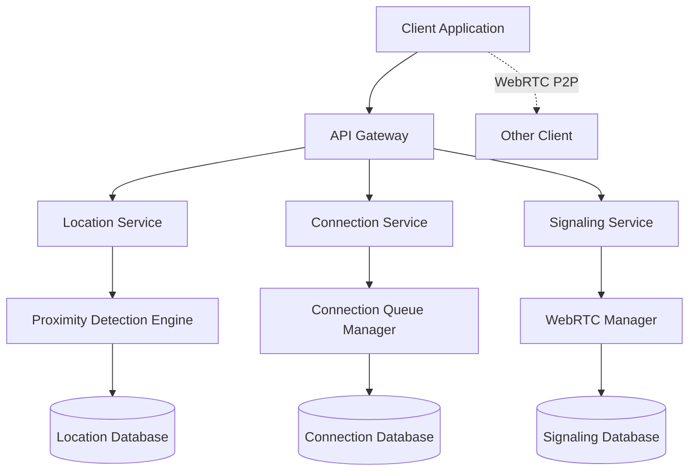

# Design Document

## Overview

The proximity-based video calling system is a real-time communication platform that automatically connects users within a specified radius (2 tiles) for video calls. The system uses WebRTC for peer-to-peer video communication, Socket.IO for real-time signaling, and geolocation APIs for proximity detection. The architecture supports automatic connection management, user queuing, and seamless transitions as users move in and out of proximity.

## Architecture

### High-Level Architecture



### System Components

1. **Location Service**: Tracks user positions and calculates proximity
2. **Proximity Detection Engine**: Determines when users enter/exit connection radius
3. **Connection Service**: Manages connection states and user queuing
4. **Signaling Service**: Handles WebRTC signaling and connection establishment
5. **Queue Manager**: Manages waiting users when connections are at capacity

## Components and Interfaces

### Location Service

**Purpose**: Track user locations and detect proximity changes

**Key Methods**:
- `updateUserLocation(userId, coordinates)`: Update user position
- `calculateProximity(user1, user2)`: Calculate distance between users
- `getUsersInRadius(userId, radius)`: Find nearby users
- `trackLocationChanges(userId)`: Monitor location updates

**Data Flow**:
1. Client sends location updates via WebSocket
2. Service updates user position in real-time database
3. Proximity engine calculates distances to other users
4. Triggers connection events when users enter/exit radius

### Connection Service

**Purpose**: Manage video call connections and user states

**Key Methods**:
- `initiateConnection(user1, user2)`: Start video call setup
- `terminateConnection(connectionId)`: End active connection
- `addToQueue(userId, targetUserId)`: Queue user for connection
- `processQueue()`: Handle waiting users when connections become available

**Connection States**:
- `IDLE`: User not connected or queued
- `CONNECTING`: Connection being established
- `CONNECTED`: Active video call
- `WAITING`: Queued for connection
- `DISCONNECTING`: Connection being terminated

### Signaling Service

**Purpose**: Handle WebRTC signaling and peer connection setup

**Key Methods**:
- `sendOffer(fromUser, toUser, offer)`: Send connection offer
- `sendAnswer(fromUser, toUser, answer)`: Send connection answer
- `exchangeICECandidates(user1, user2)`: Handle ICE candidate exchange
- `handleSignalingMessage(message)`: Process signaling messages

**WebRTC Flow**:
1. Service initiates offer/answer exchange
2. ICE candidates are exchanged for NAT traversal
3. Direct peer-to-peer connection established
4. Service monitors connection health

### Proximity Detection Engine

**Purpose**: Real-time proximity calculations and event triggering

**Key Methods**:
- `calculateDistance(coord1, coord2)`: Compute distance between coordinates
- `checkProximityChanges()`: Periodic proximity evaluation
- `triggerConnectionEvent(users, eventType)`: Emit connection events
- `updateProximityMatrix()`: Maintain distance matrix for all users

**Algorithm**:
```javascript
// Simplified proximity detection
function checkProximity(user1, user2) {
    const distance = calculateDistance(user1.location, user2.location);
    const inRadius = distance <= PROXIMITY_RADIUS;
    
    if (inRadius && !areConnected(user1, user2)) {
        triggerConnectionEvent([user1, user2], 'ENTER_RADIUS');
    } else if (!inRadius && areConnected(user1, user2)) {
        triggerConnectionEvent([user1, user2], 'EXIT_RADIUS');
    }
}
```

## Data Models

### User Model
```typescript
interface User {
    id: string;
    ipAddress: string;
    location: {
        latitude: number;
        longitude: number;
        timestamp: Date;
    };
    connectionState: ConnectionState;
    currentConnection?: string;
    queuePosition?: number;
}
```

### Connection Model
```typescript
interface Connection {
    id: string;
    participants: [string, string]; // User IDs
    status: 'ESTABLISHING' | 'ACTIVE' | 'TERMINATING';
    startTime: Date;
    endTime?: Date;
    signaling: {
        offer?: RTCSessionDescription;
        answer?: RTCSessionDescription;
        iceCandidates: RTCIceCandidate[];
    };
}
```

### Location Model
```typescript
interface LocationUpdate {
    userId: string;
    coordinates: {
        latitude: number;
        longitude: number;
    };
    timestamp: Date;
    accuracy?: number;
}
```

### Queue Model
```typescript
interface QueueEntry {
    userId: string;
    targetUserId?: string;
    joinTime: Date;
    priority: number;
}
```

## Error Handling

### Connection Failures
- **WebRTC Connection Failed**: Retry connection with exponential backoff
- **Signaling Timeout**: Clean up connection state and notify users
- **Network Disconnection**: Maintain connection state for brief reconnection window

### Location Tracking Errors
- **GPS Unavailable**: Fall back to IP-based location estimation
- **Location Permission Denied**: Disable proximity features gracefully
- **Inaccurate Location Data**: Implement location smoothing algorithms

### System Overload
- **Too Many Concurrent Connections**: Implement connection limits and queuing
- **High CPU Usage**: Optimize proximity calculations with spatial indexing
- **Memory Pressure**: Implement connection cleanup and garbage collection

### Edge Cases
- **Rapid Location Changes**: Debounce location updates to prevent connection flapping
- **Multiple Users in Same Location**: Implement fair queuing algorithm
- **Connection State Inconsistency**: Periodic state reconciliation

## Testing Strategy

### Unit Testing
- Location calculation accuracy
- Proximity detection algorithms
- Connection state management
- Queue management logic
- WebRTC signaling flows

### Integration Testing
- End-to-end connection establishment
- Location service integration
- Real-time proximity detection
- Multi-user scenarios
- Connection cleanup processes

### Performance Testing
- Concurrent user capacity
- Location update frequency impact
- Memory usage under load
- Connection establishment latency
- Proximity calculation performance

### User Acceptance Testing
- Automatic connection experience
- Connection quality and stability
- Smooth transitions when moving
- Queue behavior with multiple users
- Error recovery scenarios

### Test Scenarios
1. **Basic Proximity Connection**: Two users approach each other and auto-connect
2. **Radius Exit Disconnection**: Users move apart and auto-disconnect
3. **Third User Queuing**: Third user waits when two are already connected
4. **Queue Processing**: Waiting user connects when slot becomes available
5. **Rapid Movement**: Users moving quickly in and out of radius
6. **Network Interruption**: Connection recovery after brief network loss
7. **Location Permission Changes**: Graceful handling of permission revocation
8. **System Resource Limits**: Behavior under high load conditions